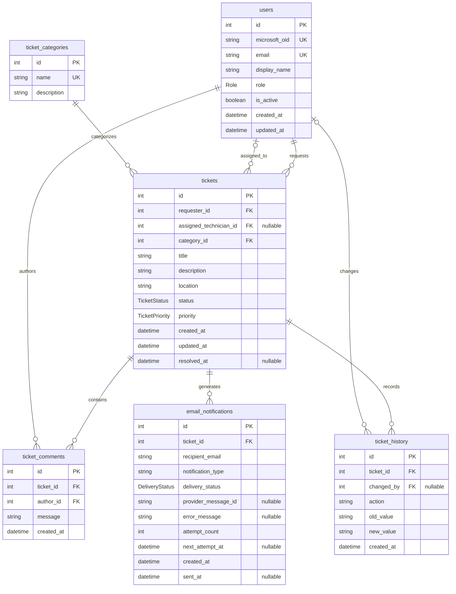

# Campus HelpDesk database ERD

Current schema after the pending migrations. Types and constraints are defined in
[schema.prisma](../prisma/schema.prisma). The Mermaid source below has not been rendered.

